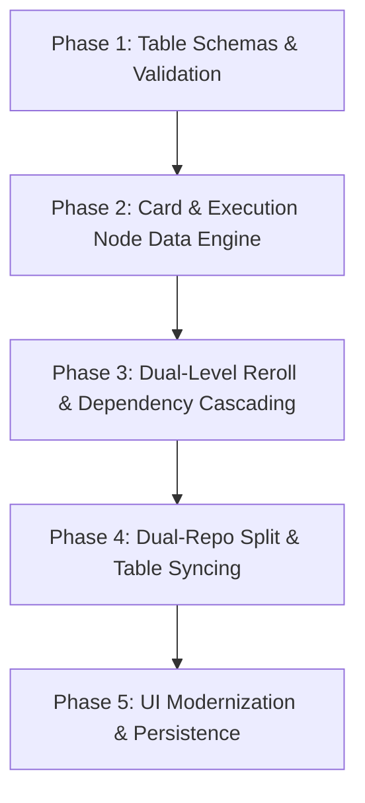

# Architecture Roadmap: TTRPG-Generator Refactor

This roadmap outlines the plan to address the architectural issues with table parsing, card provenance, embedded re-rolls, and private repository management.

---

## 1. Vision & Architecture Overview

### Key Objectives
1. **Robust Table Validation**: Formalize table schemas (YAML validation via Zod / JSON Schema) to prevent brittle runtime errors and broken cross-table references.
2. **Provenance-Aware Card Model**: Transition from raw HTML strings in the DOM to a typed, serializable `Card` and `ResultNode` tree structure that tracks roll history, recipes, dependencies, and formulas.
3. **Multi-Level Re-rolling**:
   - **Row-level re-rolls**: Re-roll an entire result from its source table with dependency cascades.
   - **Micro re-rolls**: Clickable tokens/chips for embedded dice expressions (e.g. `{1d6}`) within a row without altering the rest of the text.
4. **Dual-Repo Distribution Model**:
   - **Public Repo**: Engine, UI, build tools, and open-license/SRD tables. Hosted on GitHub Pages / Vercel.
   - **Private Repo**: Copyrighted/custom table content.
   - **Syncing**: Secure GitHub Personal Access Token (PAT) sync via browser `IndexedDB` or local File System Directory Picker for cross-device support (desktop, mobile, tablet) without complex Git submodules.

---

## 2. Phase-by-Phase Roadmap



---

### Phase 1: Table Schemas & Validation

**Goal**: Eliminate flimsy YAML parsing by defining strict schemas and automated integrity checks.

- [x] **1.1 Define Formal Schema (Zod / TypeScript)**
  - Validate core table metadata (`tablename`, `game`, `setting`, `type`, `description`).
  - Validate entry formats (strings, numbers, weighted tuples `[string, number]`, arrays, directives).
  - Explicitly define directive structures (`separateRows`, `{roll: n, exclude: true}`).
- [x] **1.2 Cross-Table Reference Linter**
  - Implement a build-time / pre-commit check verifying that references like `{TableName}` or `{useReferenceTable{...}{...}}` resolve to existing tables and keys.
- [x] **1.3 Clear Error Diagnostics**
  - Replace silent runtime fallbacks with descriptive errors indicating file name, line/key, and reason when parsing malformed entries.

---

### Phase 2: Card & Execution Node Data Engine

**Goal**: Transform cards from disposable DOM elements into a table-agnostic, persistent document model.

- [x] **2.1 Implement `ResultNode` & `Card` Types**
  - Define node hierarchy:
    ```typescript
    interface ResultNode {
      id: string;
      label: string;
      displayValue: string;
      generator: {
        sourceFile?: string;
        tableName: string;
        rawExpression?: string;
        tokens?: Token[]; // AST tokens for embedded dice/math
      };
      history: { rolledAt: number; value: string }[];
      locked: boolean;
      dependencies?: string[];
      provides?: Record<string, any>;
      children?: ResultNode[];
    }

    interface Card {
      id: string;
      title: string;
      source: { file: string; tableName: string };
      context: Record<string, any>;
      nodes: ResultNode[];
      createdAt: number;
    }
    ```
- [x] **2.2 AST Tokenizer for Expressions**
  - Parse strings containing `{1d6}`, `{{1d6} * 10}`, or `{Variable}` into token lists rather than flattening them to strings immediately.
  - Preserve the raw formula alongside the rolled value.
- [x] **2.3 Serialization & Hydration**
  - Ensure any card can be serialized to JSON, stored in LocalStorage/IndexedDB or downloaded, and rehydrated with complete re-roll capability intact.

---

### Phase 3: Dual-Level Re-rolling & Dependency Cascading

**Goal**: Enable seamless single-click re-rolls at both the macro (row) and micro (dice) levels.

- [x] **3.1 Micro Re-rolls (Embedded Dice & Math)**
  - Render formula tokens as interactive chips in the UI (e.g. `[🎲 4]`).
  - Clicking a chip re-evaluates only that dice expression, updates the node's display string, and records history.
- [x] **3.2 Row-Level Re-rolls with Provenance**
  - When re-rolling a row, execute the generator recipe stored on the node instead of inspecting the DOM or relying on the globally active table selection.
- [x] **3.3 Dependency Tracking (Cascading Updates)**
  - When a node with `provides` (e.g., `Ancestry: Elf`) is re-rolled, identify child or sibling nodes that have `Ancestry` in their `dependencies`.
  - Prompt or automatically trigger re-rolls for affected dependent fields.
- [x] **3.4 Template Cards (e.g., Monster Statblocks)**
  - Support fixed-schema template cards where some fields are static, some rollable, and some linked to fixed lookup tables.

---

### Phase 4: Dual-Repo Split & Multi-Device Sync

**Goal**: Safely separate proprietary/copyright tables from the open-source application and allow easy access for friends across devices.

- [x] **4.1 Create Private Data Repository**
  - Architecture ready to separate copyrighted table packs (`Shadowdark/`, `TomeOfAdventure/`, etc.) into a standalone private GitHub repo (e.g., `TTRPG-Tables`).
  - Open-license / CC tables remain supported and buildable in main repository.
- [x] **4.2 Client-Side Table Sync Provider**
  - Implement GitHub API integration in the web app:
    - User inputs private repo URL + Personal Access Token (fine-grained, read-only).
    - Downloads table tree into browser `IndexedDB`.
    - One-click "Sync" button pulls table updates on any device (Mac, PC, phone, tablet).
- [x] **4.3 Local Filesystem Fallback**
  - Support the HTML5 File System Access API / folder drag-and-drop for local offline development.

---

### Phase 5: UI Modernization & Persistence

**Goal**: Update the frontend to render the new card architecture smoothly with undo/redo and export.

- [x] **5.1 Card Renderer Component**
  - Render cards dynamically from the `Card` data model rather than building manual DOM strings.
  - Provide undo/redo buttons per field tied to the node's `history` stack.
- [x] **5.2 Export & Import**
  - Add export options:
    - JSON (full fidelity, re-rollable).
    - Markdown / Statblock text (for copy-pasting into VTTs or notes).
- [x] **5.3 Saved Cards Board**
  - Save cards into browser storage or local files, organized into campaigns, sessions, or tags.

